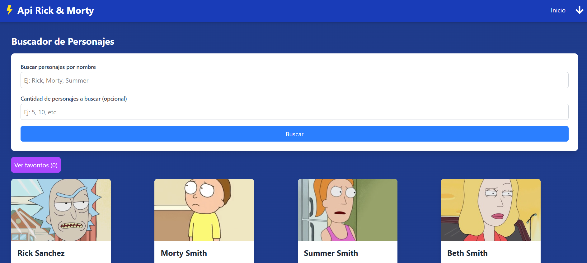
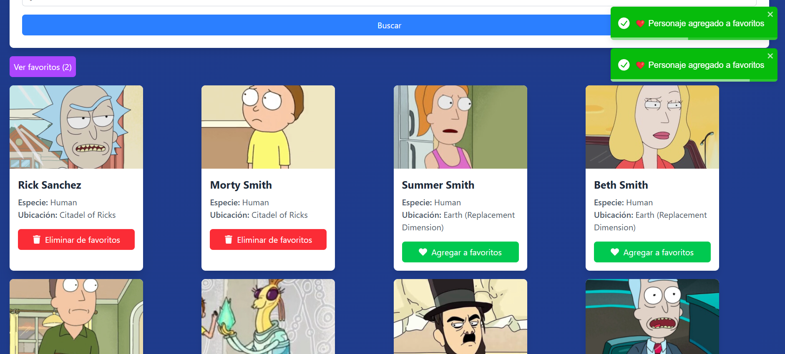
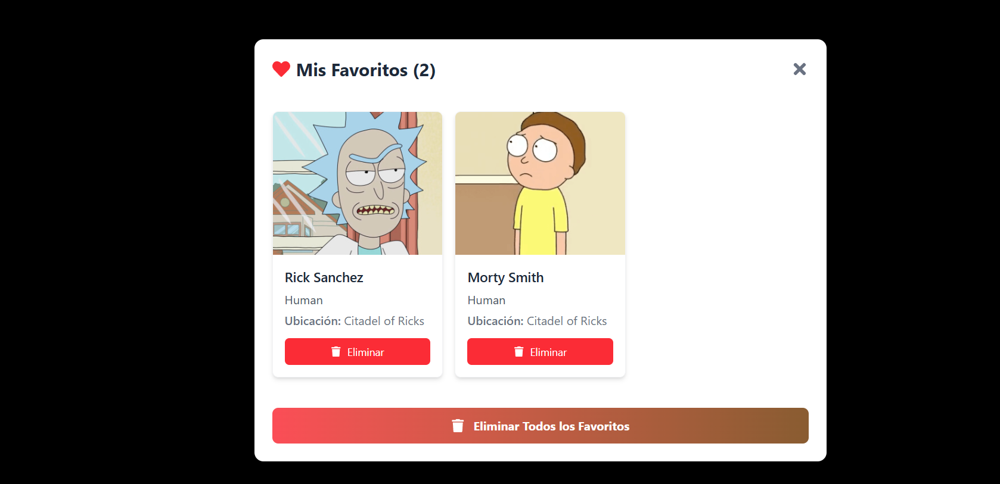

# Buscador de Personajes de Rick and Morty

¡Bienvenido al **Buscador de Personajes de Rick and Morty**! Esta aplicación te permite buscar personajes de la serie, ver sus detalles, agregarlos a tus favoritos y gestionar tu lista personalizada.

## Características Principales

- **Búsqueda de personajes**: Busca personajes por nombre.
- **Visualización de detalles**: Muestra información como especie, ubicación e imagen de cada personaje.
- **Favoritos**: Agrega personajes a tu lista de favoritos y elimínalos cuando quieras.
- **Persistencia**: Los favoritos se guardan en `localStorage` para que no se pierdan al recargar la página.
- **Diseño responsive**: La aplicación se adapta a diferentes tamaños de pantalla.

## Tecnologías Usadas

- **React**: Para la construcción de la interfaz de usuario.
- **Vite**: Como herramienta de construcción y desarrollo.
- **Axios**: Para realizar peticiones HTTP a la API de Rick and Morty.
- **TailwindCSS**: Para el diseño y estilos de la aplicación.
- **react-toastify**: Para mostrar notificaciones al usuario.
- **React Router**: Para la navegación entre páginas (opcional, si implementaste rutas).

## Requisitos Técnicos Cumplidos

1. **Uso de Axios**:
   - Se utilizó **Axios** para realizar peticiones HTTP, proporcionando una sintaxis limpia y manejo sencillo de errores.
   
2. **Renderizado de Datos y uso de useEffect**:
   - Se utilizan los hooks `useState` y `useEffect` para gestionar y mostrar los datos.
   - Se implementó un **loader** mientras se cargan los datos.

3. **Manejo de Formulario Básico**:
   - El formulario permite buscar personajes por nombre y limitar la cantidad de resultados.

4. **Manejo de Errores y Mensajes**:
   - Se capturan errores con `try/catch`.
   - Se usan notificaciones con `react-toastify` para mostrar mensajes de éxito o error.

5. **Agregar a Favorito**:
   - Los personajes se pueden agregar y eliminar de la lista de favoritos.
   - La lista de favoritos persiste en `localStorage`.

6. **Asincronía y Buenas Prácticas**:
   - Se evitan renderizados innecesarios y se gestionan las peticiones de manera eficiente.

7. **Diseño Responsive**:
   - La aplicación es completamente responsive gracias a **TailwindCSS**.

## Instalación

Sigue estos pasos para ejecutar la aplicación en tu entorno local:

1. Clona el repositorio:
   ```bash
   git clone https://github.com/tuusuario/buscador-rickandmorty.git

# cd buscador-rickandmorty
Instala las dependencias:

# npm install
Inicia el servidor de desarrollo:

# npm run dev
Abre tu navegador y visita:

## Copy
http://localhost:5173


## Estructura del Proyecto
El proyecto se organiza de la siguiente manera:
src/
├── components/       # Componentes reutilizables (CharacterCard, SearchForm, etc.)
├── hooks/            # Hooks personalizados (useLocalStorage)
├── pages/            # Páginas de la aplicación (Home, Favorites)
├── services/         # Lógica para interactuar con la API (api.js)
├── TailwindCss/      # (TailwindCSS)
├── App.jsx           # Componente principal de la aplicación
└── main.jsx          # Punto de entrada de la aplicación

Capturas de Pantalla
Página Principal


Página Principal


Modal de Favoritos



Contribuciones
Si deseas contribuir a este proyecto, sigue estos pasos:

Haz un fork del repositorio.

Crea una rama con tu nueva funcionalidad (git checkout -b feature/nueva-funcionalidad).

Realiza tus cambios y haz commit (git commit -m 'Agrega nueva funcionalidad').

Haz push a la rama (git push origin feature/nueva-funcionalidad).

Abre un Pull Request.

Licencia
Este proyecto está bajo la licencia MIT. Para más detalles, consulta el archivo LICENSE.